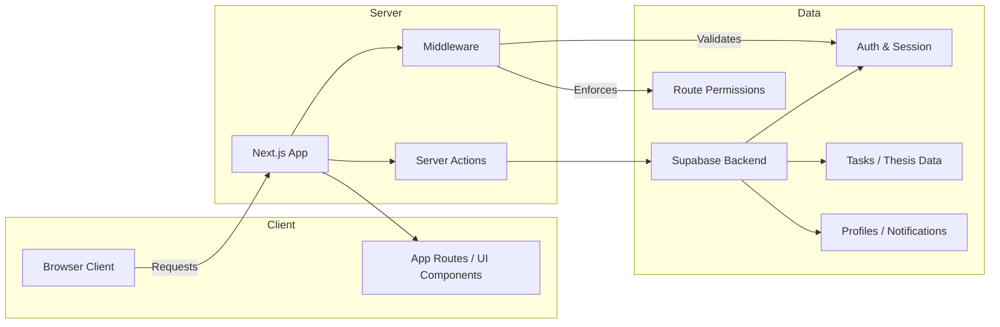

# Thesis Management Application

This repository contains a Next.js application for thesis task management, including role-based dashboards for students and supervisors, task tracking, suggestions, and gamified progress.

## Overview

The application is built on Next.js with server-side Supabase integration. It supports authenticated access, role-based routing, and task management features designed around thesis workflows.

## System Architecture



The application uses `app` routes for rendering the interface and `server` modules for business logic and data operations. Authentication and session handling are provided through Supabase, while middleware enforces route access and role checks.

## Codebase Structure

- `app/` - Next.js application routes, page layouts, and protected dashboard areas.
- `components/` - Reusable UI components organized by feature and role.
- `lib/` - Shared utilities, route definitions, translations, and Supabase client setup.
- `server/` - Server-side modules that encapsulate database interactions, task operations, supervision, notifications, and gamification.
- `schemas/` - Zod validation schemas for data shape enforcement.
- `types/` - Application type definitions and database types.
- `public/` - Static assets used in the application.

## Key Features

- Role-based access control with separate student and supervisor dashboards.
- Supabase authentication, including login, sign-up, password reset, and session validation.
- Hierarchical task management with main tasks, subtasks, and suggestion handling.
- Dynamic task status updates with Kanban-style workflow support.
- Supervisor suggestion review and acceptance flow.
- Gamification integration for task completion and progress tracking.
- Responsive interface components and modular UI design.

## Installation

Install dependencies and start the development server:

```bash
npm install
npm run dev
```

The application runs at `http://localhost:3000` by default.

## Build and Deployment

Build for production and run the optimized app:

```bash
npm run build
npm start
```

The project is compatible with standard Next.js deployment environments.

## Notes

- Supabase configuration is expected in environment variables.
- Route protection and user role checks are managed in `lib/supabase/middleware.ts`.
- Server-side task operations are implemented in `server/tasks.server.ts`, `server/supervisor.server.ts`, and related server modules.
